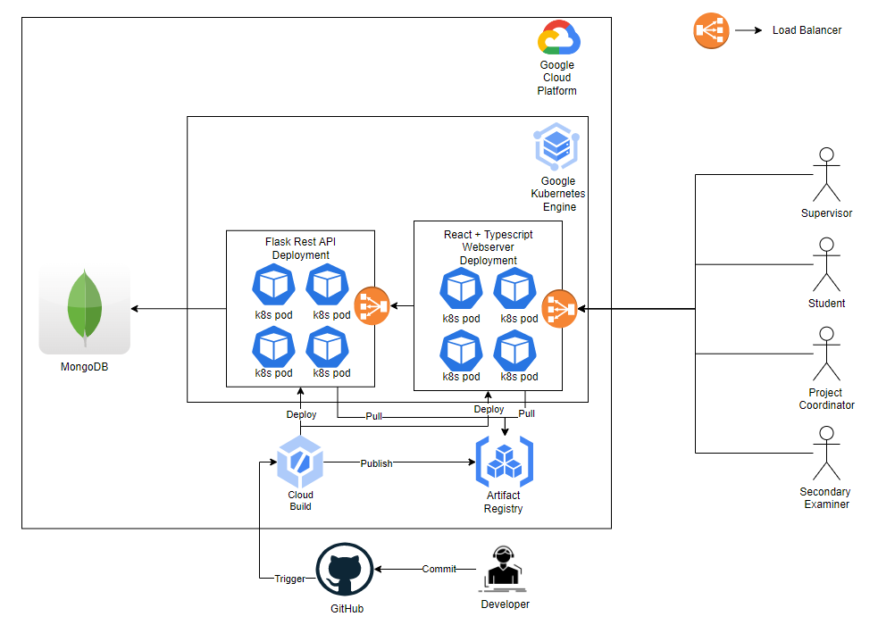

# capstone-backend

## Description
This is the backend of the Capstone Project Management System. It is a RESTful API that allows for the creation, modification, and deletion of projects and users.

## Architecture

We use the below tools/technologies to build and run our application:
- **Python** - [Python 3.8](https://docs.python.org/3/whatsnew/3.8.html) is used for this project
- **Flask** - [Flask](https://flask.palletsprojects.com/en/2.1.x/) is a micro-web framework written in python to simplify creation of RESTFUL and HTTP applications
- **GEvent** - [GEvent](http://www.gevent.org/) is a coroutine based python networking library that provides support for concurrent, api calls
- **Kubernetes** - [Kubernetes](https://kubernetes.io/) is an open-source orchestration framework used for automating deployment, scaling and management of containerized applications
- **Docker** - [Docker](https://www.docker.com/) is a PAAS product that offers OS-level virtualization through containers
- **MongoDB** - [MongoDB](https://www.mongodb.com/) is a document based no SQL database
- **Google Kubernetes Engine** - [Google Kubernetes Engine](https://cloud.google.com/kubernetes-engine) is an orchestration system for docker containers
- **Artifact Registry (GCP)** - [Artifact Registry](https://cloud.google.com/artifact-registry) is a registry to store built docker images
- **Secret Manager (GCP)** - [Secret Manager (GCP)](https://cloud.google.com/secret-manager) is to store secrets that can be accessed securely from the application
- **Cloud Build (GCP)** - [Cloud Build (GCP)](https://cloud.google.com/build) is a serverless ci/cd platform which can be used to build and deploy containers in GKE

This application uses [GKE Autopilot](https://cloud.google.com/kubernetes-engine/docs/concepts/autopilot-overview) which removes the overhead of provisioning nodes for the kubernetes cluster.
It automatically manages, optimizes the nodes, node pools in the kubernetes clusters for both development and production workloads. This reduces a lot of DevOps workload for maintaining the Kubernetes cluster.
The customers only pay for the cpu, memory used.

This application uses [MongoDB](https://www.mongodb.com/) as a database storage layer. Since, most of the data is written and queried in a document-based format, MongoDB is chosen. 
MongoDB is deployed as a SAAS tool in GCP to make sure the rest api has very low latency.

This application uses [Secret Manager (GCP)](https://cloud.google.com/secret-manager) to store secrets such as api keys for song data provider last-fm and mongodb credentials. 
This provides a secure way to access the keys during runtime and helps avoid writing keys in the code.

This application uses [Cloud Build (GCP)](https://cloud.google.com/build) to automatically build and deploy the code into GKE autopilot cluster whenever new commits are pushed to the [GitHub repo](https://github.com/nehabthakur/playlist-sharify) main branch.
We have adopted the [GitOps](https://www.weave.works/technologies/gitops/) methodology of CI/CD to automatically deploy changes once they're developed and tested.
We have created a trigger in Cloud Build that continuously polls the GitHub repo's main branch and looks for [cloudbuild file](cloudbuild.yaml) and runs the following steps. 
Builds the image and pushes it to [Artifact Registry (GCP)](https://cloud.google.com/artifact-registry). 
It will then deploy the kubernetes config files defined in [tools/k8s/gke](tools/k8s/gke) to GKE Autopilot cluster automatically.

## Code

- All the external python libraries are defined in [requirements.txt](requirements.txt)
- The starting point of code is [main.py](main.py) which loads the environment variables and starts the rest api application server 
- [app.py](src/app.py) consists of all the routing, logging information for the rest api
- [src.utils](src/utils) package consists of utility functions to support calling mongodb
- [cloudbuild.yaml](cloudbuild.yaml) file consists of the ci/cd steps defined as code
- [tools/docker](tools/docker) directory consists of the Dockerfile which packages the application as a container image
- [tools/k8s](tools/k8s) directory consists of yaml files to run the built container image in kubernetes

## Instructions

### Pre-requisites
- [Docker Desktop](https://www.docker.com/products/docker-desktop/)
- [Python](https://www.python.org/downloads/)
- [Kubernetes](https://kubernetes.io/releases/download/)
- [Postman](https://www.postman.com/downloads/)

### Additional Pre-requisites for running on cloud
- [Google cloud](https://cloud.google.com/) - Create a Google cloud account, setup billing
- [MongoDB cloud](https://www.mongodb.com/cloud) - Create a mongodb account and launch an instance in google cloud(free or standard)

### Local
This will run the application directly on the personal machine on port 5000. Below are the steps:

#### Steps
1. Store the mongodb creds in a json format as an env variable with name `MONGO_CREDS` and format `{"username": "<update the value here>","password":"<update the value here>","cluster_id":"<update the value here>"}`
2. Run `python main.py` to run the application.
3. Application can be accessed using this [localhost:5000](http://localhost:5000)

### Local Kubernetes
This will run the application using Kubernetes on the personal machine on port 5000. Below are the steps:

#### Steps
1. Update the `MONGO_CREDS` in [K8s config](tools/k8s/local/01-deployment.yaml) in a json format `{"username": "<update the value here>","password":"<update the value here>","cluster_id":"<update the value here>"}`
2. Build the docker image using `docker build -t playlist-sharify:latest -f tools/docker/Dockerfile .`
3. Deploy image using `kubectl apply -f .\tools\k8s\local\`
4. Application can be accessed using this [localhost:5000](http://localhost:5000)

### GKE
This will run the application using GKE autopilot on google cloud. Below are the steps:

#### Steps
1. Create an [GKE Autopilot](https://console.cloud.google.com/kubernetes/list/overview) Cluster
2. Create a secret in [Secret Manager](https://console.cloud.google.com/security/secret-manager) with name `mongodb_credentials` in a json format `{"username": "<update the value here>","password":"<update the value here>","cluster_id":"<update the value here>"}`
3. Create a trigger in [Cloud Build](https://console.cloud.google.com/cloud-build/triggers) that triggers a build when a new commit is pushed to the main branch in GitHub
4. Trigger should have the following properties:
   1. Event should be `Push to a branch`
   2. Connect the GitHub Repo and set branch to `^main$`
   3. Configuration should use Cloud Build Configuration file
   4. Location should be Repository and set the configuration file to be `cloudbuild.yaml`
   5. Set the following substitution variables
      1. `_API_SECRET_VERSION` -> `<Set the API Secret Version>`
      2. `_GKE_CLUSTER_ID` -> `<Set the GKE cluster id>`
      3. `_IMAGE` -> `capstone-backend`
      4. `_LOCATION` -> `<Set the location as per your preference>`
      5. `_MONGO_DB_SECRET` -> `mongodb_credentials`
      6. `_MONGO_DB_SECRET_VERSION` -> `<Set the MongoDB Secret Version>`
      7. `_REPOSITORY` -> `<Set the Repository Name>`
5. Enable Access to `GKE` and `Secret Manager` in [Cloud Build](https://console.cloud.google.com/cloud-build/settings/service-account) settings
6. Deploy and start the service either by pushing a new commit or running the cloud build trigger [manually](https://console.cloud.google.com/cloud-build/triggers)
7. Access the app by opening the endpoint in `capstone-backend-service` in [GKE Services Page](https://console.cloud.google.com/kubernetes/discovery)
